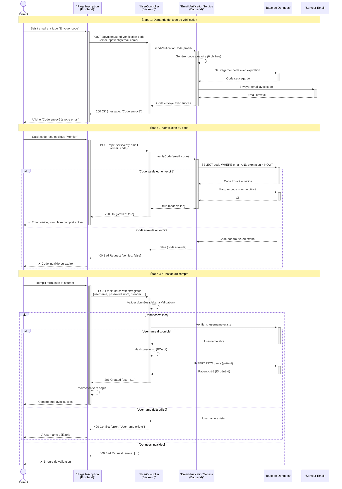
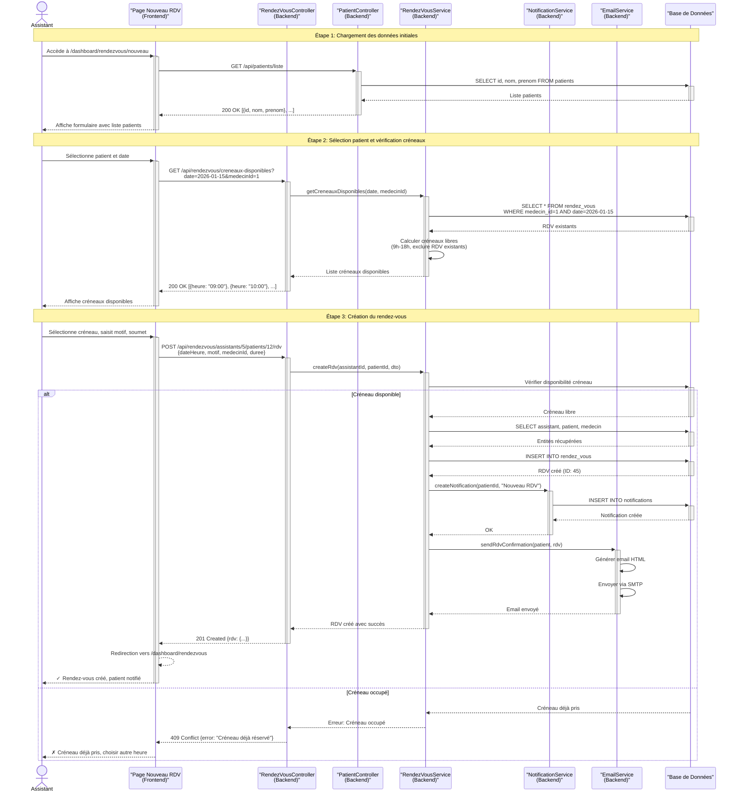
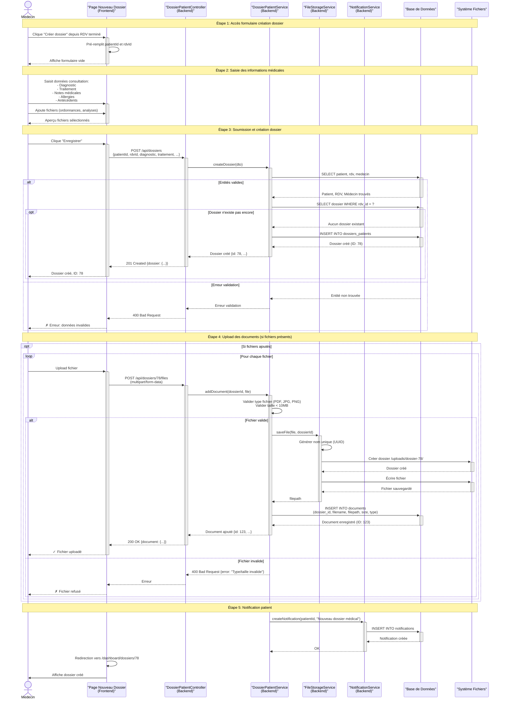
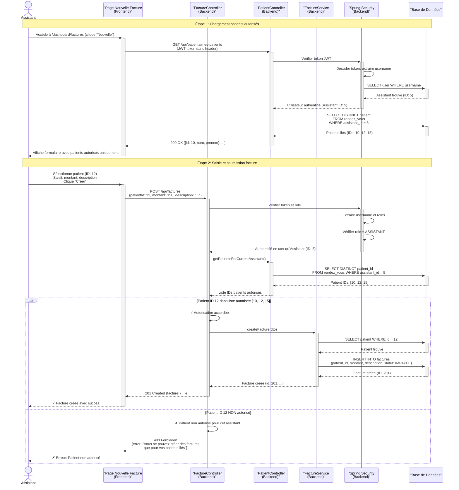
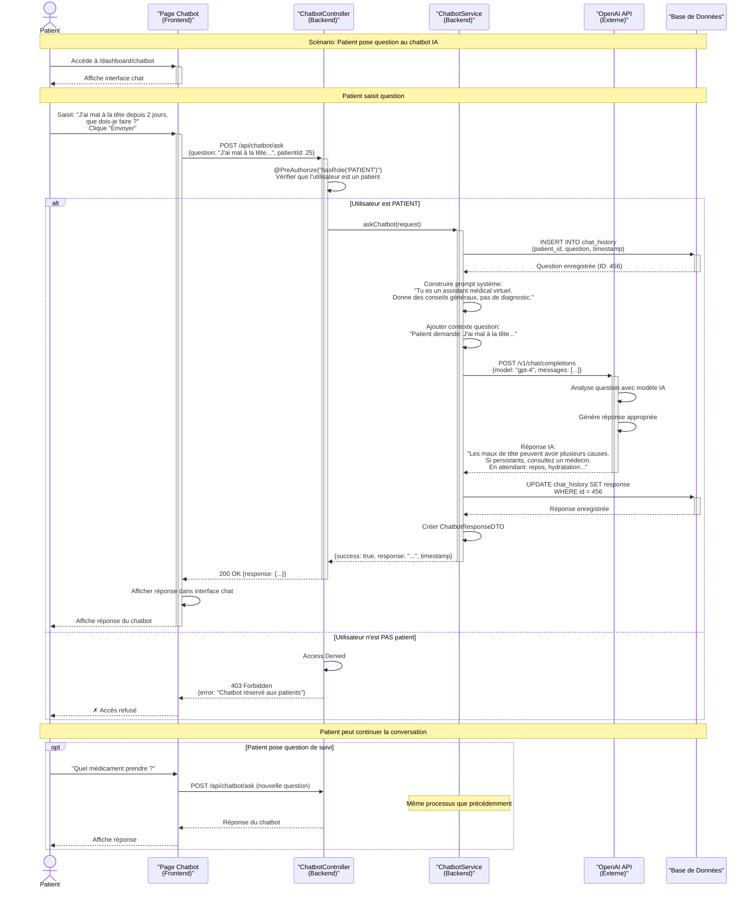
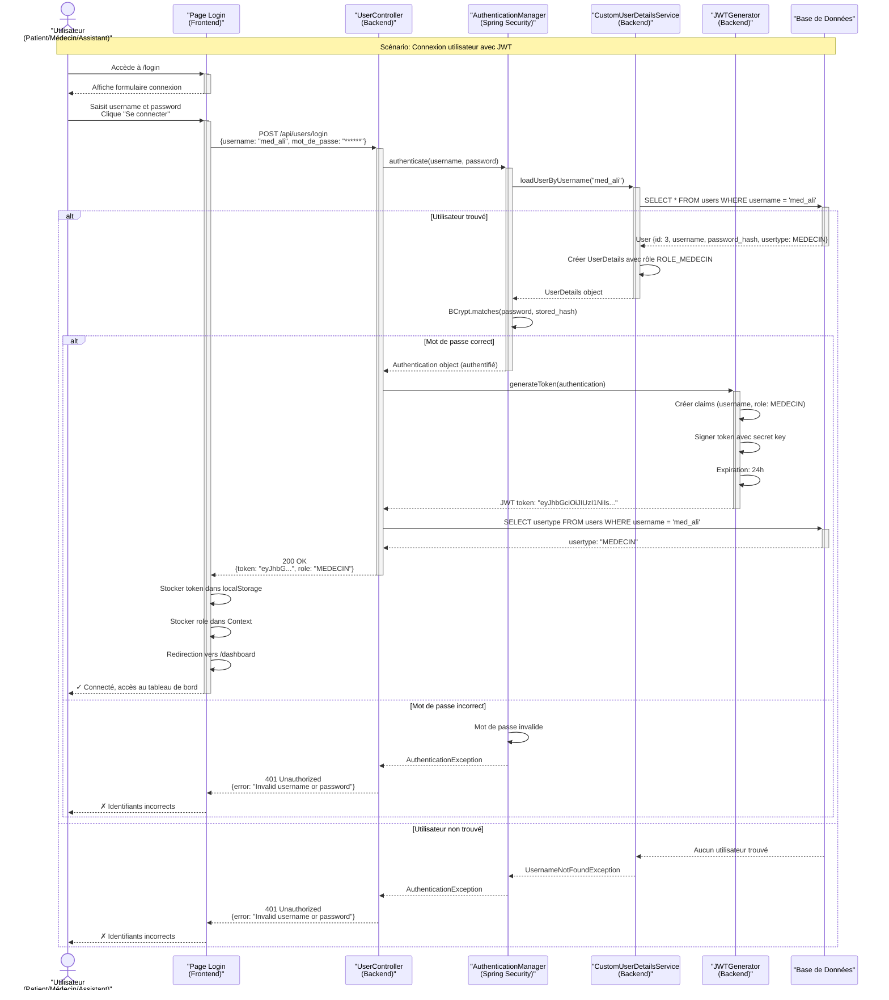
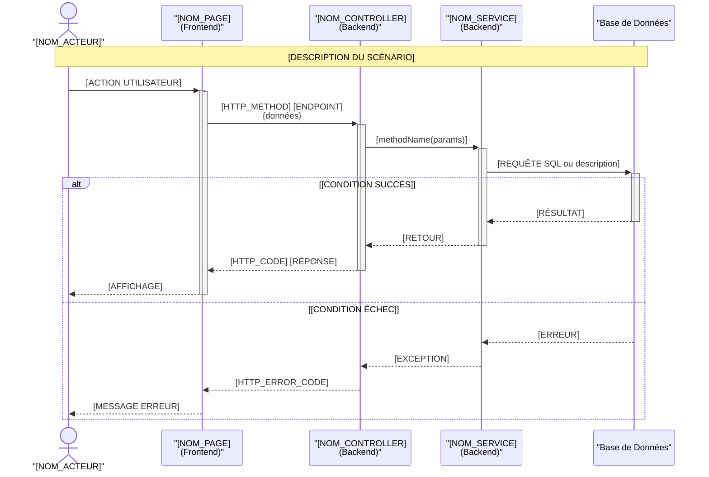

# 🤖 GUIDE D'UTILISATION DE L'IA POUR ACCÉLÉRER LA RÉDACTION DU RAPPORT

**Projet Fédérateur - Cabinet Médical**  
**Guide pour Wajdi, Nesrine, Fares, Menyar**

---

## 📌 RÉPARTITION DES CHAPITRES PAR SPRINT

| Membre | Chapitre | Contenu |
|--------|----------|---------|
| **Wajdi** | Chapitre 2 | Étude Préliminaire |
| **Nesrine** | Chapitre 3 | Gestion d'espace Médecin (Sprint 1) |
| **Fares** | Chapitre 4 | Gestion d'espace Assistant (Sprint 2) |
| **Menyar** | Chapitre 5 | Gestion d'espace Patient (Sprint 3) |

---

## 🚀 COMMENT UTILISER L'IA POUR ACCÉLÉRER LE TRAVAIL

### Option 1: GitHub Copilot Chat (Recommandé)
Dans VS Code, ouvrez Copilot Chat et copiez-collez les prompts fournis ci-dessous.

### Option 2: ChatGPT / Claude
Copiez les prompts dans ChatGPT ou Claude, en ajoutant le contexte de notre projet.

### Option 3: Copilot Edits
Utilisez Copilot Edits dans VS Code pour générer directement dans des fichiers Markdown.

---

## 📘 CHAPITRE 2: ÉTUDE PRÉLIMINAIRE (Wajdi)

### Structure du Chapitre 2

```
2.1 INTRODUCTION
2.2 Spécification des besoins
    2.2.1 Identification des acteurs
    2.2.2 Les besoins fonctionnels
    2.2.3 Les besoins non fonctionnels
2.3 Détails fonctionnels
    2.3.1 Diagramme de cas d'utilisation global
    2.3.2 Diagramme de classe global
2.4 Mise en œuvre
    2.4.1 Product backlog
    2.4.2 Planification des sprints
    2.4.3 Diagramme de Gantt
    2.4.4 L'architecture du système
2.5 CONCLUSION
```

---

### 🎯 PROMPT POUR CHAPITRE 2 - Section 2.1 INTRODUCTION

```
Contexte: Je travaille sur un projet de gestion de cabinet médical avec Spring Boot et Next.js.
Le système gère 4 acteurs: Patient, Médecin, Assistant, et un Chatbot IA.

Rédige une introduction pour le chapitre "Étude Préliminaire" qui:
- Présente l'importance de l'étude préliminaire dans le développement
- Explique la méthodologie Scrum/Agile utilisée
- Annonce les sections du chapitre (spécification besoins, détails fonctionnels, mise en œuvre)
- Contexte: système de gestion de cabinet médical moderne avec IA
- Ton académique, 2-3 paragraphes
```

---

### 🎯 PROMPT POUR CHAPITRE 2 - Section 2.2.1 Identification des acteurs

```
Contexte: Projet cabinet médical avec 4 acteurs principaux.

Voici les acteurs identifiés dans mon système:
1. PATIENT - Utilisateur qui consulte et gère ses informations médicales
2. MÉDECIN - Professionnel qui gère consultations, dossiers, supervise assistants
3. ASSISTANT - Personnel administratif gérant RDV, patients, facturation
4. SYSTÈME (Chatbot IA) - Assistant virtuel pour questions médicales

Rédige la section 2.2.1 "Identification des acteurs" en:
- Présentant chaque acteur avec description détaillée
- Expliquant leur rôle dans le système
- Justifiant leur importance
- Utiliser un tableau récapitulatif si possible
- Ton académique
```

---

### 🎯 PROMPT POUR CHAPITRE 2 - Section 2.2.2 Besoins fonctionnels

```
Contexte: Cabinet médical, 4 acteurs, utilise Spring Boot + Next.js

Voici les fonctionnalités principales par acteur:

PATIENT:
- Authentification avec vérification email
- Gestion rendez-vous (consultation)
- Consultation dossiers médicaux
- Chatbot IA pour questions
- Gestion notifications
- Téléchargement documents

MÉDECIN:
- Gestion complète des assistants (CRUD)
- Gestion patients
- Gestion rendez-vous avec calendrier
- Création/modification dossiers médicaux
- Upload documents (ordonnances, analyses)
- Gestion factures et paiements
- Rapports financiers
- Notifications

ASSISTANT:
- Création patients
- Création/modification rendez-vous
- Création factures (patients liés uniquement)
- Consultation dossiers (lecture seule)
- Notifications

CHATBOT:
- Répondre aux questions médicales des patients
- Analyse symptômes avec IA

Rédige la section 2.2.2 "Besoins fonctionnels" en:
- Organisant par acteur
- Détaillant chaque fonctionnalité
- Expliquant la valeur métier
- Utilisant des listes à puces claires
- Ton académique et structuré
```

---

### 🎯 PROMPT POUR CHAPITRE 2 - Section 2.2.3 Besoins non fonctionnels

```
Rédige la section 2.2.3 "Besoins non fonctionnels" pour un système de cabinet médical.

Couvre ces aspects:

1. SÉCURITÉ:
- Authentification JWT
- Chiffrement mots de passe (BCrypt)
- Contrôle d'accès basé sur les rôles (RBAC)
- Protection des données médicales sensibles (RGPD)

2. PERFORMANCE:
- Temps de réponse < 2 secondes
- Support de 100+ utilisateurs simultanés
- Optimisation requêtes base de données

3. DISPONIBILITÉ:
- Disponibilité 99.5%
- Sauvegarde quotidienne des données
- Plan de reprise après sinistre

4. UTILISABILITÉ:
- Interface responsive (mobile, tablette, desktop)
- Navigation intuitive
- Support multi-navigateurs

5. MAINTENABILITÉ:
- Architecture modulaire (Spring Boot microservices potentiel)
- Code documenté
- Tests unitaires et intégration

6. CONFORMITÉ:
- Respect RGPD (données médicales)
- Secret médical
- Traçabilité des accès

Rédige de manière académique avec justifications.
```

---

### 🎯 PROMPT POUR CHAPITRE 2 - Section 2.4.1 Product Backlog

```
Contexte: Projet cabinet médical en méthodologie Scrum.

Voici les User Stories principales:

SPRINT 0 (Préparation):
- Configuration environnement (Spring Boot, Next.js, BD)
- Setup sécurité (JWT, Spring Security)
- Architecture système

SPRINT 1 (Espace Médecin):
- US-01: En tant que médecin, je veux me connecter
- US-02: En tant que médecin, je veux créer un assistant
- US-03: En tant que médecin, je veux gérer mes assistants
- US-04: En tant que médecin, je veux consulter le calendrier de RDV
- US-05: En tant que médecin, je veux créer un dossier médical
- US-06: En tant que médecin, je veux générer un rapport financier

SPRINT 2 (Espace Assistant):
- US-07: En tant qu'assistant, je veux me connecter
- US-08: En tant qu'assistant, je veux créer un patient
- US-09: En tant qu'assistant, je veux créer un rendez-vous
- US-10: En tant qu'assistant, je veux créer une facture
- US-11: En tant qu'assistant, je veux consulter mes patients liés

SPRINT 3 (Espace Patient):
- US-12: En tant que patient, je veux m'inscrire avec vérification email
- US-13: En tant que patient, je veux me connecter
- US-14: En tant que patient, je veux consulter mes RDV
- US-15: En tant que patient, je veux consulter mes dossiers médicaux
- US-16: En tant que patient, je veux poser des questions au chatbot
- US-17: En tant que patient, je veux télécharger mes documents

Crée un tableau Product Backlog avec colonnes:
- ID
- User Story
- Priorité (Haute/Moyenne/Basse)
- Sprint assigné
- Estimation (points de complexité)
- Statut

Format académique.
```

---

### 🎯 PROMPT POUR CHAPITRE 2 - Section 2.4.2 Planification des sprints

```
Contexte: Projet cabinet médical, 3 sprints principaux (+ Sprint 0).

Durée de chaque sprint: 2 semaines

Rédige la section "Planification des sprints" en détaillant:

SPRINT 0 (Initialisation - 1 semaine):
- Setup environnement développement
- Configuration Spring Boot + Next.js
- Setup base de données
- Configuration sécurité (JWT)
- Architecture système

SPRINT 1 (Espace Médecin - 2 semaines):
- Authentification médecin
- CRUD Assistants
- Gestion rendez-vous
- Création dossiers médicaux
- Gestion factures
- Rapports financiers

SPRINT 2 (Espace Assistant - 2 semaines):
- Authentification assistant
- CRUD Patients
- Création rendez-vous
- Création factures (avec restrictions)
- Consultation dossiers

SPRINT 3 (Espace Patient - 2 semaines):
- Inscription avec email verification
- Authentification patient
- Consultation rendez-vous
- Consultation dossiers médicaux
- Chatbot IA
- Téléchargement documents

Pour chaque sprint, détaille:
- Objectifs
- Fonctionnalités développées
- Critères d'acceptation
- Livrables

Ton académique.
```

---

### 🎯 PROMPT POUR CHAPITRE 2 - Section 2.4.4 Architecture du système

```
Contexte: Cabinet médical avec architecture 3-tiers (Frontend, Backend, BD).

Technologies:
- Frontend: Next.js 14 (React, TypeScript, Tailwind CSS)
- Backend: Spring Boot 3.5.7 (Java 21, Spring Security, JPA)
- Base de données: PostgreSQL/MySQL
- Sécurité: JWT
- Services externes: OpenAI (Chatbot), SMTP (Emails)

Rédige la section "Architecture du système" en décrivant:

1. Architecture globale (3-tiers)
2. Couche Présentation (Frontend):
   - Next.js avec App Router
   - Pages et composants
   - Gestion état (Context API)
   - Communication API REST

3. Couche Métier (Backend):
   - Controllers REST
   - Services métier
   - Repositories (JPA)
   - Sécurité (Spring Security + JWT)
   - Services transversaux (Email, Notifications, Chatbot)

4. Couche Données:
   - Base de données relationnelle
   - Modèle entité-relation
   - Gestion fichiers (uploads)

5. Flux de données
6. Diagramme d'architecture (décrire verbalement pour inclusion future)

Ton académique et technique.
```

---

## 📗 CHAPITRES 3, 4, 5: GESTION D'ESPACES (Nesrine, Fares, Menyar)

### Structure commune pour chapitres 3, 4, 5

```
X.1 INTRODUCTION
X.2 Backlog de sprint X
X.3 Spécifications fonctionnelles
    X.3.1 Diagramme de cas d'utilisation du sprint X
    X.3.2 Descriptions textuelles
X.4 Conception
    X.4.1 Diagrammes de séquences
    X.4.2 Diagrammes de classes de sprint X
X.5 Réalisation
X.6 CONCLUSION
```

---

### 🎯 PROMPT GÉNÉRIQUE - Section X.1 INTRODUCTION (Adapter selon l'acteur)

```
Contexte: Chapitre sur la gestion de l'espace [MÉDECIN/ASSISTANT/PATIENT] dans un système de cabinet médical.

Rédige une introduction qui:
- Rappelle le contexte du sprint [1/2/3]
- Présente l'acteur [MÉDECIN/ASSISTANT/PATIENT] et son rôle
- Annonce les fonctionnalités développées dans ce sprint
- Explique l'importance de cet espace pour le système global
- Présente la structure du chapitre

Ton académique, 2-3 paragraphes.
```

**Exemple pour Nesrine (Médecin):**
```
Contexte: Chapitre 3 sur la gestion de l'espace MÉDECIN (Sprint 1) dans un système de cabinet médical.

Le médecin est l'acteur principal qui supervise l'ensemble du cabinet, gère les assistants, 
les dossiers médicaux, et les aspects financiers.

Fonctionnalités du sprint 1:
- Authentification médecin
- Création et gestion des assistants
- Gestion du calendrier de rendez-vous
- Création de dossiers médicaux avec upload de documents
- Gestion des factures et paiements
- Génération de rapports financiers

Rédige l'introduction du chapitre 3.
```

---

### 🎯 PROMPT - Section X.2 Backlog de Sprint

```
Contexte: Sprint [1/2/3] - Gestion espace [MÉDECIN/ASSISTANT/PATIENT]

User Stories du sprint:

[COLLER LES USER STORIES DEPUIS LA DOCUMENTATION_UML.md]

Crée un tableau "Backlog de Sprint X" avec:
- ID User Story
- Description (En tant que... je veux... afin de...)
- Priorité (Haute/Moyenne/Basse)
- Estimation (points)
- Critères d'acceptation (3-4 points par US)
- Statut (À faire/En cours/Terminé)

Format académique et professionnel.
```

---

### 🎯 PROMPT - Section X.3.2 Descriptions textuelles

```
Contexte: Description détaillée des cas d'utilisation pour Sprint [X]

User Story: [TITRE DE LA USER STORY]

Crée une description textuelle complète avec:

**Titre:** [Nom du cas d'utilisation]
**Acteur principal:** [Médecin/Assistant/Patient]
**Acteurs secondaires:** [Système, BD, Services externes]
**Préconditions:** [Ce qui doit être vrai avant]
**Déclencheur:** [Événement qui lance le cas d'utilisation]

**Scénario nominal (flux principal):**
1. L'acteur [action]
2. Le système [réaction]
3. ...
[Étapes détaillées jusqu'à la fin]

**Scénarios alternatifs:**
- 2a. Si [condition]: [action alternative]
- 3a. Si [erreur]: [gestion erreur]

**Postconditions:** [État du système après succès]
**Règles métier:** [Règles spécifiques]

Format académique, détaillé et précis.
```

---

## 🎨 DIAGRAMMES DE SÉQUENCE EN MERMAID

### 📐 Format standard des diagrammes

Tous les diagrammes de séquence doivent suivre ce format:

```
Actor (lifeline) → Interface Frontend (boundary) → Service Backend (control) → BD (entity)
```

**Éléments à utiliser:**
- ✅ Activation bars (rectangles sur les lifelines)
- ✅ Messages synchrones (flèches pleines)
- ✅ Messages de retour (flèches pointillées)
- ✅ Conditions (alt/opt/loop)
- ✅ Notes explicatives
- ✅ Destruction (X) si nécessaire

---

## 📊 EXEMPLES DE DIAGRAMMES MERMAID

### Exemple 1: Inscription Patient avec Vérification Email



---

### Exemple 2: Création Rendez-vous par Assistant



---

### Exemple 3: Création Dossier Médical par Médecin



---

### Exemple 4: Création Facture par Assistant (avec contrôle d'accès)



---

### Exemple 5: Question au Chatbot (Patient)



---

### Exemple 6: Connexion Utilisateur (Tous acteurs)



---

## 🔧 COMMENT GÉNÉRER VOS DIAGRAMMES

### Méthode 1: Avec un prompt IA

```
Contexte: Projet cabinet médical, Spring Boot + Next.js, acteurs: Patient/Médecin/Assistant

User Story: [COLLER LA USER STORY]

Endpoints impliqués:
- [ENDPOINT 1]
- [ENDPOINT 2]

Services backend:
- [SERVICE 1]
- [SERVICE 2]

Tables BD:
- [TABLE 1]
- [TABLE 2]

Génère un diagramme de séquence en syntaxe Mermaid qui montre:
- Actor (lifeline)
- Page Frontend (boundary lifeline)
- Controller Backend (control lifeline)
- Service Backend (control lifeline si différent du controller)
- Base de Données (entity lifeline)

Inclus:
- Activation bars sur chaque lifeline quand active
- Messages synchrones (flèches pleines →)
- Messages retour (flèches pointillées -->>)
- Conditions alt/opt si nécessaire
- Notes explicatives
- Gestion erreurs (else)

Format: code Mermaid valide, prêt à copier dans draw.io ou un éditeur Mermaid.
```

---

### Méthode 2: Template à adapter

Voici un template générique à adapter:



---

## 📚 RESSOURCES POUR CHAQUE MEMBRE

### Pour Wajdi (Chapitre 2 - Étude Préliminaire)

**Utilise ce fichier:** `DOCUMENTATION_UML.md`

**Sections clés à exploiter:**
- Acteurs du système
- Fonctionnalités par acteur
- Matrice d'autorisation
- Architecture système

**Diagrammes à créer:**
- Use Case global (4 acteurs)
- Diagramme de classes global
- Diagramme de Gantt (planification)

---

### Pour Nesrine (Chapitre 3 - Espace Médecin)

**User Stories principales:**
- US-01: Connexion médecin
- US-02: Créer un assistant
- US-03: Gérer assistants (activer/désactiver)
- US-04: Consulter calendrier RDV
- US-05: Créer dossier médical
- US-06: Générer rapport financier

**Endpoints:**
- `/api/users/login`
- `/api/assistants/*`
- `/api/rendezvous/medecin/{id}`
- `/api/dossiers`
- `/api/factures/rapport-financier`

**Diagrammes séquence à créer:**
1. Connexion médecin (adapte Exemple 6)
2. Création assistant (adapte structure Exemple 1)
3. Création dossier médical (utilise Exemple 3)
4. Génération rapport financier (crée nouveau)

---

### Pour Fares (Chapitre 4 - Espace Assistant)

**User Stories principales:**
- US-07: Connexion assistant
- US-08: Créer un patient
- US-09: Créer un rendez-vous
- US-10: Créer une facture
- US-11: Consulter patients liés

**Endpoints:**
- `/api/users/login`
- `/api/patients`
- `/api/rendezvous/assistants/{id}/patients/{id}/rdv`
- `/api/factures`
- `/api/patients/mes-patients`

**Diagrammes séquence à créer:**
1. Connexion assistant (adapte Exemple 6)
2. Création patient (adapte structure Exemple 1)
3. Création RDV (utilise Exemple 2)
4. Création facture avec contrôle accès (utilise Exemple 4)

---

### Pour Menyar (Chapitre 5 - Espace Patient)

**User Stories principales:**
- US-12: Inscription avec vérification email
- US-13: Connexion patient
- US-14: Consulter mes RDV
- US-15: Consulter mes dossiers médicaux
- US-16: Poser question au chatbot
- US-17: Télécharger documents

**Endpoints:**
- `/api/users/send-verification-code`
- `/api/users/verify-email`
- `/api/users/Patient/register`
- `/api/users/login`
- `/api/rendezvous/me`
- `/api/dossiers/me`
- `/api/chatbot/ask`
- `/api/dossiers/{id}/files/{docId}`

**Diagrammes séquence à créer:**
1. Inscription avec email verify (utilise Exemple 1)
2. Connexion patient (adapte Exemple 6)
3. Consultation dossiers (adapte Exemple 3 en lecture)
4. Question chatbot (utilise Exemple 5)
5. Téléchargement document (crée nouveau)

---

## 🎨 OUTILS POUR VISUALISER LES DIAGRAMMES MERMAID

### Option 1: Mermaid Live Editor (En ligne)
🔗 https://mermaid.live/

1. Copiez le code Mermaid
2. Collez dans l'éditeur
3. Visualisez en temps réel
4. Exportez en PNG/SVG

### Option 2: VS Code Extension
📦 Extension: "Markdown Preview Mermaid Support"

1. Installez l'extension
2. Créez un fichier `.md`
3. Ajoutez le code Mermaid entre ` ```mermaid ` et ` ``` `
4. Prévisualisez avec `Ctrl+Shift+V`

### Option 3: Draw.io (Convertir depuis Mermaid)
🔗 https://app.diagrams.net/

1. Fichier → Import → Text
2. Collez le code Mermaid
3. Ajustez le style si nécessaire
4. Exportez

---

## ✅ CHECKLIST POUR CHAQUE CHAPITRE

### Chapitre 2 (Wajdi)
- [ ] 2.1 Introduction rédigée
- [ ] 2.2.1 Acteurs identifiés (tableau + descriptions)
- [ ] 2.2.2 Besoins fonctionnels (par acteur)
- [ ] 2.2.3 Besoins non fonctionnels (6 catégories)
- [ ] 2.3.1 Diagramme Use Case global créé
- [ ] 2.3.2 Diagramme de classes global créé
- [ ] 2.4.1 Product Backlog (tableau avec toutes US)
- [ ] 2.4.2 Planification sprints (4 sprints détaillés)
- [ ] 2.4.3 Diagramme de Gantt créé
- [ ] 2.4.4 Architecture système décrite + schéma
- [ ] 2.5 Conclusion rédigée

### Chapitres 3, 4, 5 (Nesrine, Fares, Menyar)
- [ ] X.1 Introduction rédigée
- [ ] X.2 Backlog de sprint (tableau avec US du sprint)
- [ ] X.3.1 Diagramme Use Case du sprint créé
- [ ] X.3.2 Descriptions textuelles (pour chaque US principale)
- [ ] X.4.1 Diagrammes de séquences (4-5 diagrammes minimum)
- [ ] X.4.2 Diagramme de classes du sprint créé
- [ ] X.5 Réalisation (captures d'écran + code clé)
- [ ] X.6 Conclusion rédigée

---

## 🚀 CONSEILS FINAUX

### 1. Travaillez en parallèle
- Chacun dans son chapitre
- Réunions régulières pour cohérence
- Partagez les diagrammes pour éviter duplication

### 2. Utilisez l'IA intelligemment
- Donnez toujours le contexte complet
- Vérifiez et adaptez les réponses
- Ne copiez pas aveuglément, comprenez

### 3. Maintenez la cohérence
- Utilisez les mêmes noms (entités, services, endpoints)
- Référez-vous à `DOCUMENTATION_UML.md`
- Style académique uniforme

### 4. Qualité des diagrammes
- Utilisez Mermaid pour uniformité
- Activation bars sur toutes les lifelines
- Alt/opt pour conditions
- Notes pour clarification

### 5. Validation
- Relecture croisée entre membres
- Vérifiez que les diagrammes correspondent au code réel
- Testez les diagrammes dans Mermaid Live Editor

---

## 📞 SUPPORT

Si vous avez des questions:
1. Consultez `DOCUMENTATION_UML.md` en premier
2. Utilisez les exemples Mermaid fournis
3. Adaptez les prompts à vos besoins spécifiques
4. Partagez entre vous les bonnes pratiques

---

**Bonne rédaction à tous ! 🎓📝**

*Document créé pour faciliter la rédaction du rapport académique*  
*Projet Fédérateur - Cabinet Médical - Janvier 2026*
